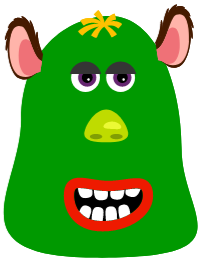
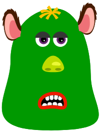
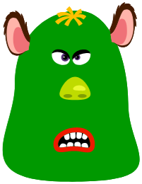

# Micro_Chatbot_Challenge
This is our ChatBot Challenge

Workers on this project are :
=============================
- Sylvain Haenen : Javascript
- François Leleu : Project Manager and Javascript
- Sandrine Bataganira : Javascript
- Sara brzn : Html and CSS

We have implemented these functions to the bot :
========================================================
- on loading of the page, the bot welcomes the user with a random greeting message, then, he ask the user "how do you feel today?".
- The user can reply freely, and the bot need to check in the response if he can find a "yes" or a "no":
- if the script find a "yes" in the message, the bot answers with a random sentence from a specific set of three
- if the script find a "no" in the message, the bot answers with a random sentence from a specific set of three
- if the script cannot find a "yes" or a "no" in the message, the bot answer "__ACTUAL ANSWER__"
- if the script cannot find a "yes" or a "no" in the message after three attempts, the bot begins to be mad and use "__ACTUAL ANSWER__"
- After this answer, the bot has finish his routine. He says "__ACTUAL ANSWER__" to the user and the textarea go to disabled mode.
- And change of expression for the bot in relation with his comprehension of the questions.
an these three images :
=======================

For the verifications :
=======================
The HTML and CSS pass the W3C Validation tool with a score of :

The lighthouse test scores is : on Performance,  on Best Practices, on Accessibility and SEO.